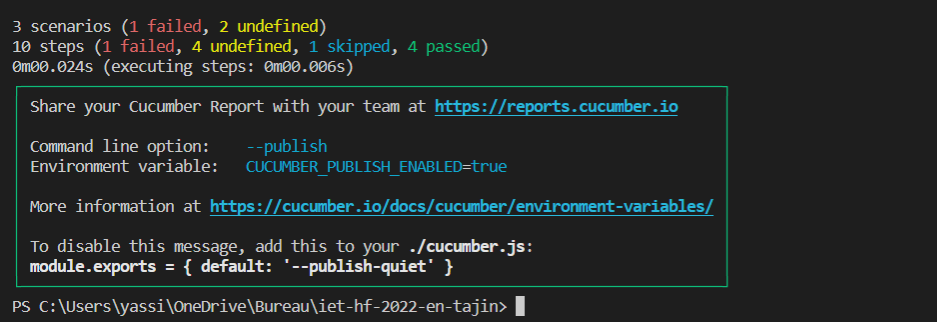

# Bdd testing 
Behavior-driven development is a testing practice that follows the idea of specification by example.
The idea is to describe how the application should behave in a very simple user-focused language.

# Cucumber

Cucumber is a tool that supports BDD, it works with any programming language. 
I tried to implement some tests accourding to the projects and the test cases already built in in the Library.
I used multiple extension in vs code to make it easier to write steps and features.

I implemented two features and this is how they behaved :

