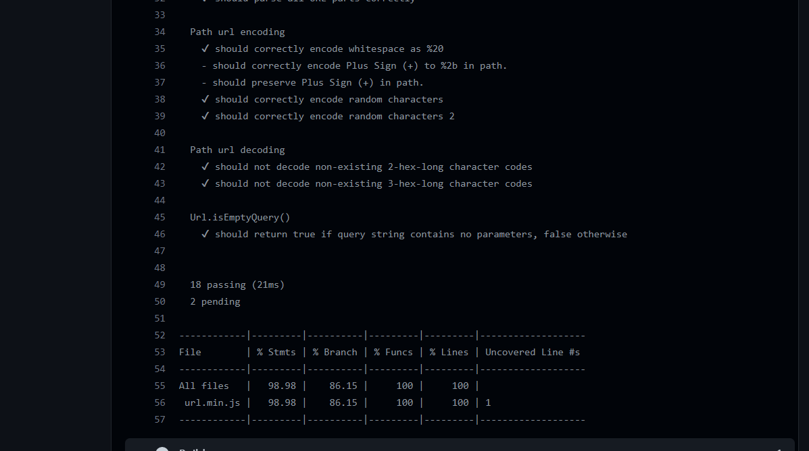
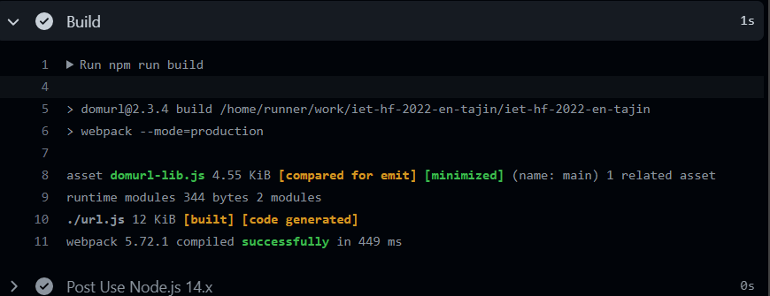
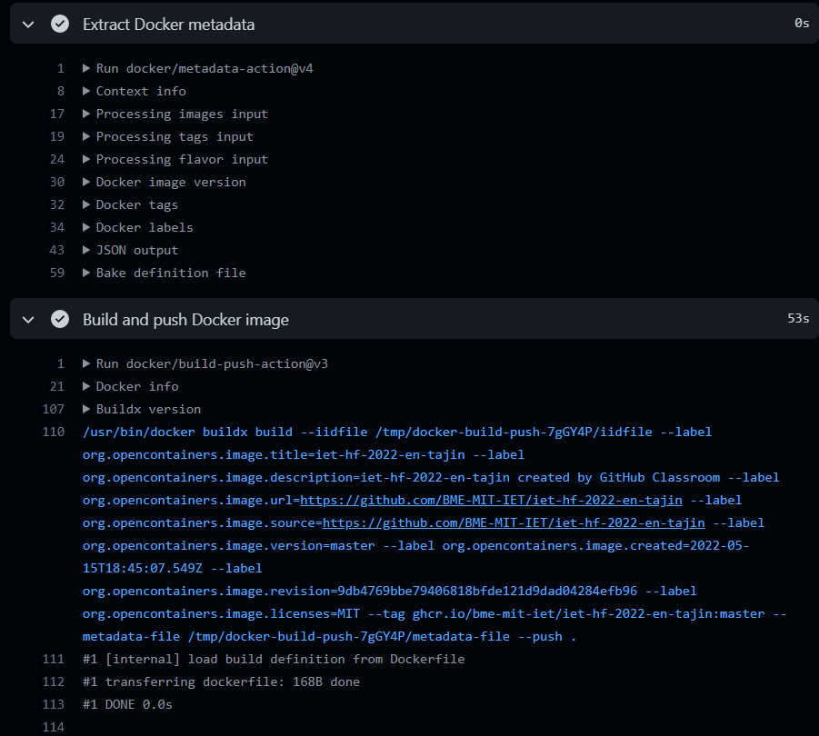
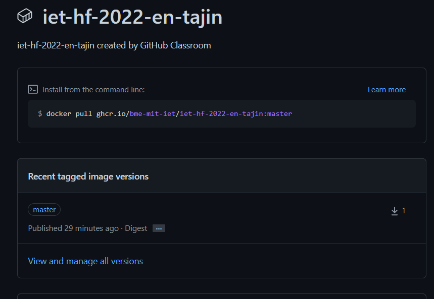

# CI Documentation 

GitHub Actions is a continuous integration and continuous delivery (CI/CD) platform that allows you to automate your build, test, and deployment pipeline.

In our project we have 2 workflows:

### NodeJs with Webpack 
- Install the required dependencies using `npm`
- Run Unit test using `Mocha` and test coverage using `Istanbul`
- Build the library using `Webpack`

#### Result 
The workfow is triggered for each pull request to the master branch. 
##### Test

##### Build

### Docker and GitHub container registry 
- Log into GitHub container registry 
- Build Docker image 
- Push Docker image to ghcr 

- ghcr package: 
  
  