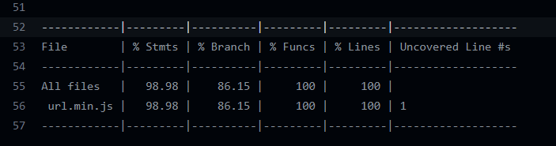

# Code coverage Documentation 

[Istanbul](https://istanbul.js.org) is a code coverage tool that instruments JavaScript code with line counters, so that we can track how well the unit-tests exercise the codebase.

## Test coverage 
`Istanbul` runs perfectly with `Mocha`, you just need to install it and the `nyc` command to your **test** command: `nyc mocha test.js`

#### Output:

