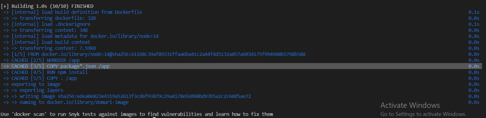

# Docker Documentation

Docker in general simplifies the process of building, running, managing and distributing applications, 
This is done by creating an image out of the project. 
Usually Docker enables faster software delivery cycles aka deployement, but in our case it, as it is a library there is no need to do so.
But it is a good practice to always dockerize the application.

# Docker File

the docker file contains the dependencies needed for the project to run.
and in our case the tests that were conducted while building the project.

By running the shell code included in the project docker automatically creates the image and run its container.

There is also some commands to stop the container.

# Running the container

This gives us the test results:

