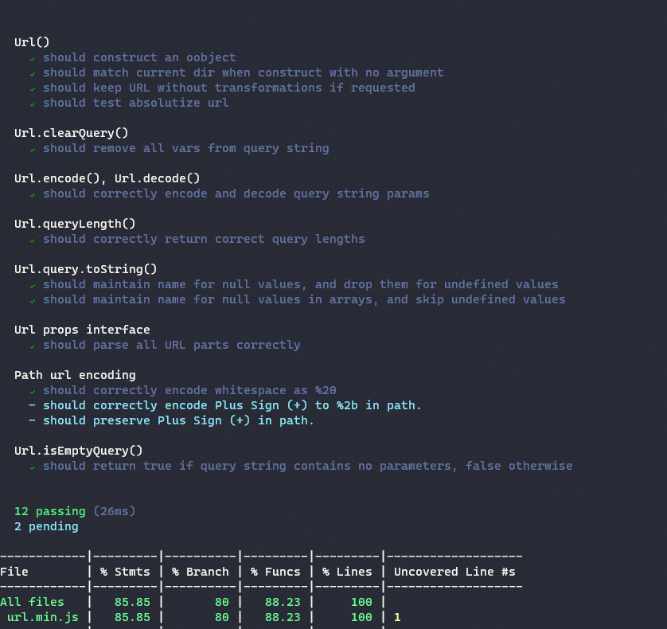
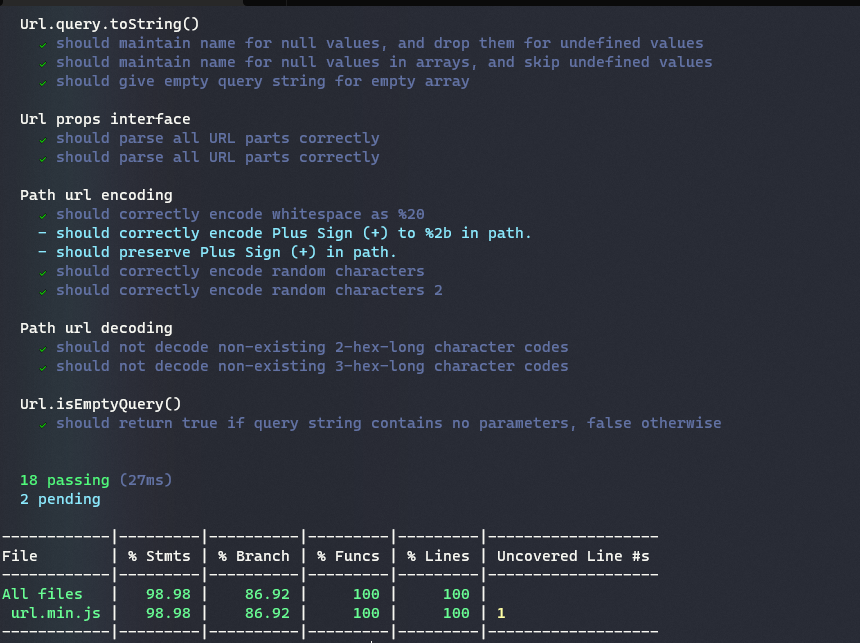

# Extending Unit Tests DOCUMENTATION

## OVERVIEW:

 In order to get a higher coverage test we have extended some of the unit tests and added a new ones.The new functions coverage reached 100%.The old tests and the new one are all located in url.js file.
 
 Commands to run tests:
 old tests: npm run test-original
 all tests: npm run test

## The old coverage:

## These new tests were:

*if the query gets an empty array, it is converted correctly and the end result will be an empty query string.
*whether the URL is broken down into appropriate parts, which is then worked on.
*can you encode the characters in the path correctly (encoding)
detects if it finds non-existent character codes of two or three hexes when decoding.
*isEmptyQuery () function.

## The new coverage:

## Conclusion:

By implementing these, we almost completed the code coverage and tested all the major components of the program.

