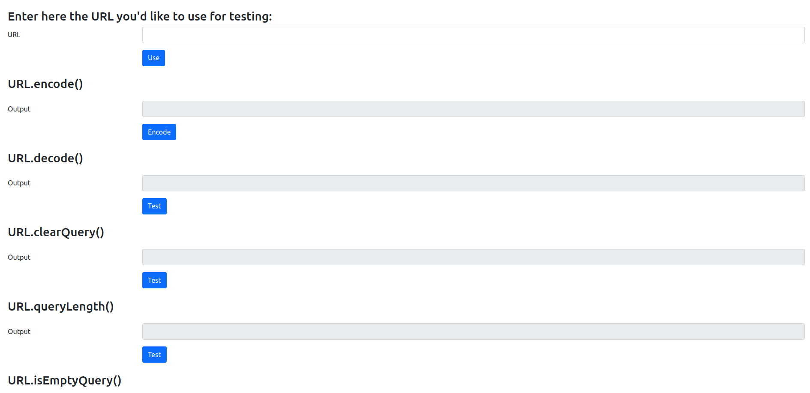
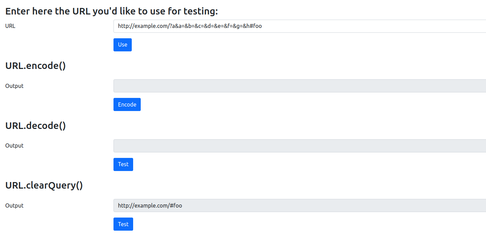

# MANUAL TESTING DOCUMENTATION

## OVERVIEW:

The main purpose of this manual testing is to enable the user to test the library on his own. All main components of the library can be tested.

A User Interface is available as you can see in the screenshot below 

## HOW TO USE:

Running the tests is pretty simple. The first step is the user has to enter the URL he wants to use for testing, then press the button "Use".

Then, simply choose the function you want to test and click the button "Test", and you can see the result in the output field.

