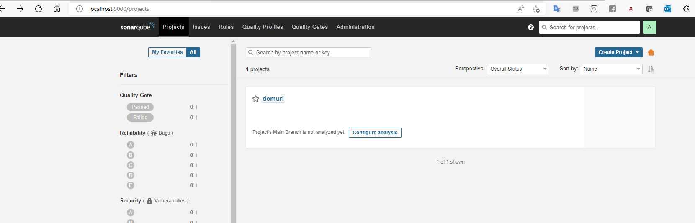
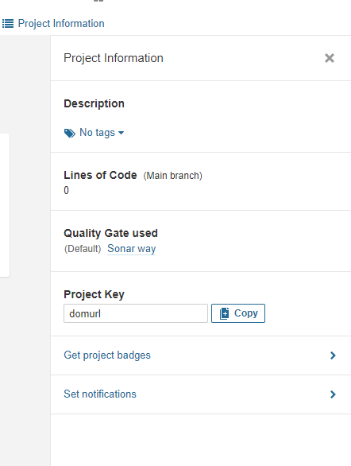
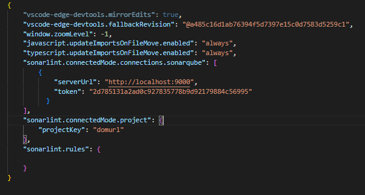
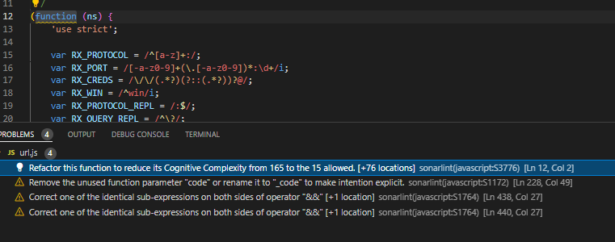
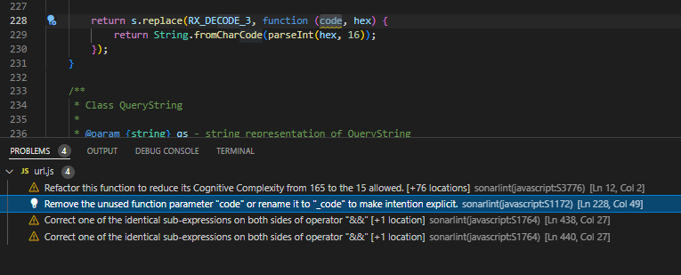
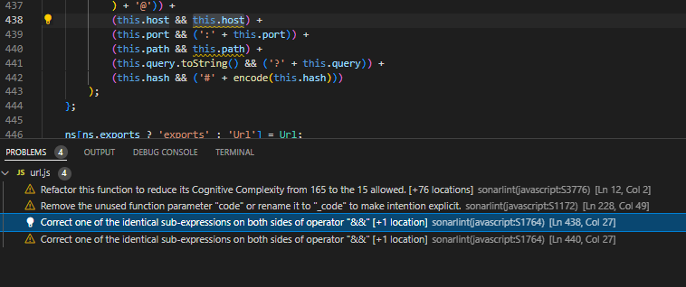
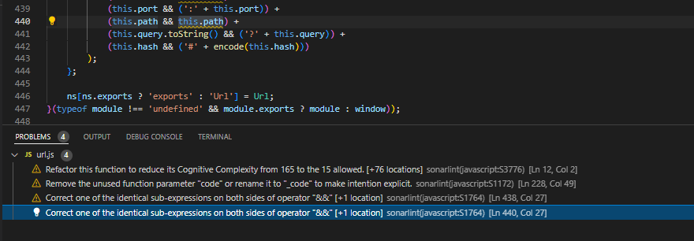
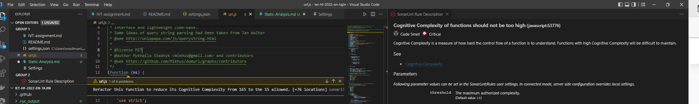
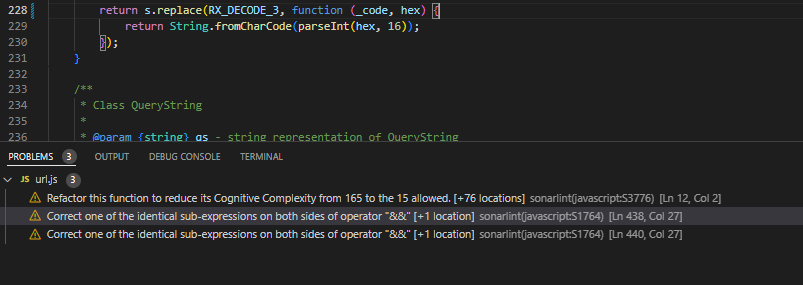

- what is sonarqube ?
SonarQube is a Code Quality Assurance tool that collects and analyzes source code, and provides reports for the code quality of your project.
It combines static and dynamic analysis tools and enables quality to be measured continually over time.

First, we have to install Sonarqube locally from Sonarqube.org we donaloaded the community version.
  - it is zip file we need to extract it then navigare to bin/windows-x86-64 or whatever OS we are using
  - the we run command StartSonar.bat after that we are able to navigate to localhost:9000 and then login to sonarqube.
  
  - create our new project and generating the access token and the project key.
  

- Why SonarLint ?
Secondly, we need to install Sonarlint as it is the agent that allows us to connect to the sonarqube server and execute the analysis remotely.

- steps of installing  sonarlint, the linlk below contains the whole steps and configurations 
https://www.google.com/url?sa=t&rct=j&q=&esrc=s&source=web&cd=&cad=rja&uact=8&ved=2ahUKEwiSvrv4--H3AhUNzIsKHXqgCPQQFnoECAQQAw&url=https%3A%2F%2Fchiamakaikeanyi.dev%2Fhow-to-setup-sonarqube-in-vscode%2F&usg=AOvVaw3vPtOtPLkpjBSEomUomqaK
and here are the configurations that we need to do.

- identiyfying the errors
we found these four errors in the screenshots.
1-

2-

3-

4-

- Fixing errors.
  - First error
     the attcahed solution was recommended for the first error but it does not work
     

  - Second error
  Th quickfix for this problem was to convert the parameter code to _code to make intention explicit and it worked correctly.
  

  - Thrird error
  we tried to solve this error as the quickfix recommend but it does not work
     
